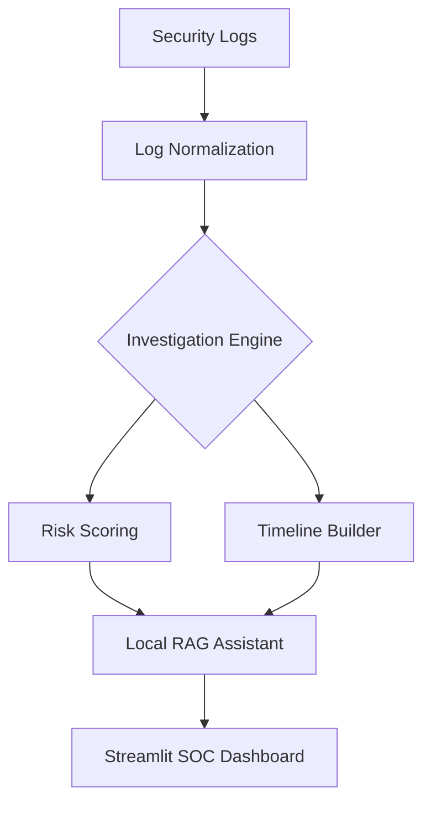

```markdown
# SentinelOps: AI-Assisted Security Investigation Toolkit

**SentinelOps** is a modular security investigation platform designed to simulate and automate SOC analysis for identity-based threats. By combining rule-based analytics with a **Local Retrieval-Augmented Generation (RAG)** pipeline, it transforms raw authentication telemetry into actionable, analyst-grade investigation summaries.

---

## 🚀 Key Features

### 1. Authentication Telemetry Pipeline
Normalizes disparate logs into a unified schema, tracking:
* **Identity:** User, Application, MFA Status.
* **Context:** IP Address, Geo-location, ASN/ISP.
* **Environment:** Device ID, Browser Fingerprint, VPN Indicators.

### 2. Alert Investigation Engine
Modular components that perform automated "pre-triage":
* **Alert Explainer:** Contextualizes triggers like *Impossible Travel* or *Anomalous Timing*.
* **False Positive Checker:** Cross-references known devices and VPN exit nodes to generate a confidence score.
* **Timeline Builder:** Reconstructs the "blast radius" around an event (e.g., login attempts across multiple regions).
* **Entity Risk Profiler:** Aggregates risk scores for specific Users, IPs, and Devices.

### 3. AI Investigation Assistant (Local RAG)
Unlike cloud-based AI, SentinelOps uses a **privacy-first local pipeline** to interpret alerts:
* **Inference:** Ollama (Llama 3.1 8B).
* **Vector Store:** ChromaDB.
* **Knowledge Base:** Security playbooks and NIST-mapped response procedures.

---

## 🏗️ Architecture



---

## 🛠️ Tech Stack

* **Language:** Python 3.11+
* **Frontend:** Streamlit (Interactive SOC Dashboard)
* **Data Science:** Pandas, NumPy
* **AI/ML:** Ollama, Llama 3.1, ChromaDB (Vector DB)

---

## 💻 Getting Started

### Prerequisites

* [Ollama](https://ollama.com/) installed and running.
* Python 3.9+

### Installation

1. **Clone & Setup**
```bash
git clone [https://github.com/YOUR_USERNAME/sentinelops.git](https://github.com/YOUR_USERNAME/sentinelops.git)
cd sentinelops
pip install -r requirements.txt

```


2. **Download Local Models**
```bash
ollama pull llama3.1:8b
ollama pull nomic-embed-text

```


3. **Initialize Knowledge Base**
```bash
python utils/build_rag_store.py

```


4. **Launch Dashboard**
```bash
streamlit run app/dashboard.py

```


---

## 📖 Example Analysis

**Input Alert:** `Impossible Travel detected for rkhatri@company.com`

**AI Summary Output:**

> "The system detected a login from Durham, US followed by Berlin, DE within 3 minutes. While the device ID matched a known asset, the source IP is a known TOR exit node. Recommended Action: **Immediate Session Revocation.**"

---

## 🛡️ Project Purpose

This project demonstrates how security analytics pipelines can be combined with local AI models to assist analysts during identity-based alert investigations. Focus areas include:

* Authentication Anomaly Detection
* Alert Triage Automation
* Explainable AI (XAI) Workflows

---

## 👤 Author

**Rishal Khatri** *Computer Science (Cybersecurity)* **University of New Hampshire '26**

```
