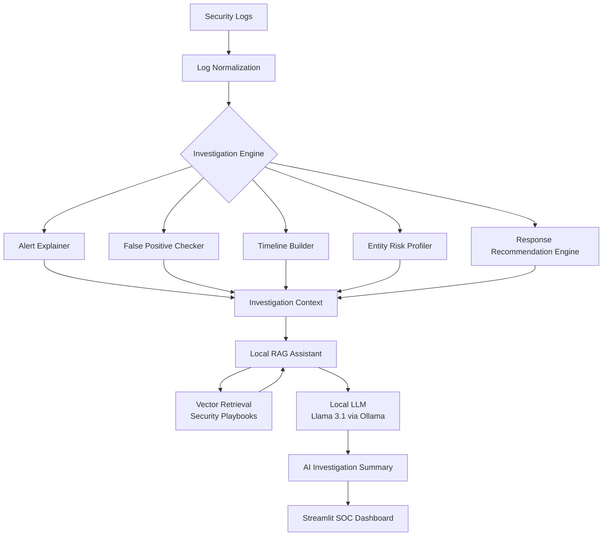

# SentinelOps: AI-Assisted Security Investigation Toolkit

**SentinelOps** is a modular security investigation platform that simulates how a Security Operations Center (SOC) analyzes identity-based alerts. 

The system processes authentication telemetry, reconstructs investigation context, evaluates risk signals, and utilizes a **local Retrieval-Augmented Generation (RAG)** pipeline to generate professional, analyst-grade investigation summaries. This project demonstrates the synergy between rule-based security analytics and local AI models in high-stakes alert triage.

---

## 🚀 Key Features

### 🛡️ Authentication Telemetry Pipeline
Ingests and normalizes logs to provide a unified foundation for analysis, including:
* **Identity:** User, Application, MFA Status.
* **Context:** IP Address, Geo-location, ASN/ISP.
* **Environment:** Device ID, Browser Fingerprint, VPN Indicators.

### 🔍 Alert Investigation Engine
Modular components that perform automated "pre-triage":
* **Alert Explainer:** Contextualizes triggers like *Impossible Travel* or anomalous login timing.
* **False Positive Checker:** Evaluates benign indicators (known devices, VPN usage) to produce a confidence score.
* **Timeline Builder:** Reconstructs the sequence of events surrounding an alert for full context.
* **Entity Risk Profiler:** Calculates real-time risk scores for Users, Devices, and IP addresses.

### 🤖 AI Investigation Assistant (Local RAG)
A privacy-first local AI component that generates natural language investigation summaries using:
* **Inference:** Ollama (Llama 3.1 8B).
* **Vector Store:** ChromaDB.
* **Knowledge Base:** Security playbooks and incident response frameworks.

---

## 🏗️ Architecture & Workflow





## 🛠️ Tech Stack

* **Language:** Python 3.11+
* **Frontend:** Streamlit (Interactive SOC Dashboard)
* **Data Science:** Pandas, NumPy
* **AI/ML:** Ollama (Llama 3.1 8B), ChromaDB (Vector DB)
* **Infrastructure:** Local Retrieval-Augmented Generation (RAG)

---

## 💻 Getting Started

### Prerequisites
* [Ollama](https://ollama.com/) installed and running.
* Python 3.9+

### 1. Installation
```bash
git clone [https://github.com/YOUR_USERNAME/sentinelops.git](https://github.com/YOUR_USERNAME/sentinelops.git)
cd sentinelops
pip install -r requirements.txt
```
### 2. Setup Local AI Models
Install [Ollama](https://ollama.com/) and pull the required models for the RAG pipeline:

```bash
ollama pull llama3.1:8b
ollama pull embeddinggemma
```
3. Initialize & Run
```bash
# Build the Vector Knowledge Base from security playbooks
python utils/build_rag_store.py

# Launch the interactive SOC Dashboard
streamlit run app/dashboard.py
```
---

## 📖 Example Output

**Input Alert:** `Impossible Travel detected for rkhatri@company.com`

**AI Investigation Summary:**
> "The alert indicates a potential **impossible travel** event. The user logged in from Durham, US and then Berlin, DE within three minutes using a new device. False positive analysis found no VPN evidence, increasing the likelihood of credential misuse. **Recommended Action: Escalate alert and revoke active sessions.**"

---

## 🛡️ Project Purpose

This project demonstrates how security analytics pipelines can be combined with local AI models to assist analysts during identity-based alert investigations. Key focus areas include:

* **Authentication Anomaly Detection:** Identifying geographic and temporal outliers in login behavior.
* **Alert Triage Automation:** Reducing analyst fatigue by reconstructing event context automatically.
* **Explainable AI (XAI):** Providing clear, natural language reasoning for risk scores and response recommendations.

---

## 👤 Author

**Rishal Khatri** *Computer Science: Cybersecurity * University of New Hampshire '26
